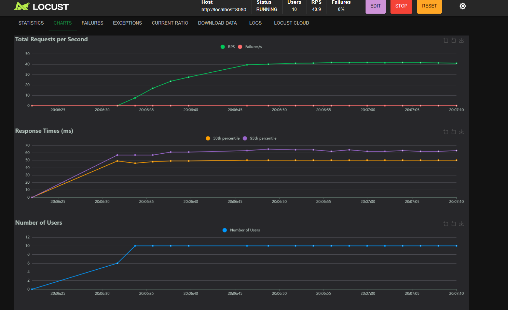
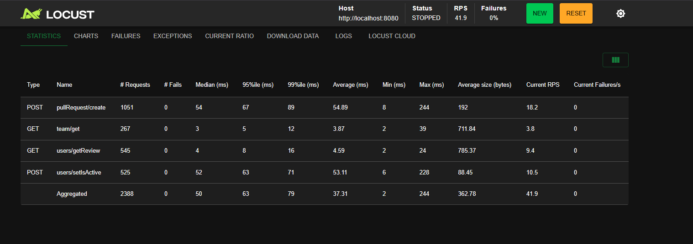

# PR-Reviewer-Assignment-Service

Сервис для назначения ревьюеров на pull request’ы.  
Состоит из Go‑backend’а (`reviewer-api`), PostgreSQL и вспомогательных скриптов для нагрузки и заполнения БД.

---

## Структура проекта

- `reviewer-api/` — Go‑сервис.
  - `cmd/reviewer-api/main.go` — входная точка API.
  - `cmd/migrate/main.go` — миграции (GORM AutoMigrate).
  - `internal/app/ds` — модели БД (`Team`, `User`, `PullRequest`, `Reviewer`).
  - `internal/app/http-server/handlers` — HTTP‑хендлеры.
  - `internal/app/service` — Сервисный слой
  - `Dockerfile` — сборка сервиса.
- `docker-compose.yaml` — Postgres + backend.
- `seed.sql` — SQL‑скрипт для заполнения БД тестовыми данными.
- `testing/` — Python‑скрипты для сидинга и нагрузочного тестирования.
- `README.md` — этот файл.

---

## Запуск через Docker

1. Создайте файл `.env` в корне репозитория (либо используйте имеющийся):

   ```env
   HTTP_HOST=0.0.0.0
   HTTP_PORT=8080

   DB_HOST=postgres
   DB_PORT=5432
   DB_NAME=postgres
   DB_USER=postgres
   DB_PASS=postgres
   DB_OPEN_PORT=5433 #порт на который пробрасывается бд
   ```


### 2. Запуск через Docker Compose

```docker-compose up --build ```
Таблицы создадутся автоматически при запуске контейнеров. Для заполнения их тестовыми данными (200 users и 20 teams) воспользуйтесь python-скриптами (см ```Нагрузочное тестирование и заполнен данными (Python)```)

- Приложение: [http://localhost:8080](http://localhost:8080)


### 3. Миграции БД

**Локально (создают только сами таблицы, без заполнения данных):**

```cd reviewer-api
go run ./cmd/migrate
```

## Тестирование

### Unit-тесты (Go)

```cd reviewer-api
go test ./internal/app/http-server/...
go test ./internal/app/service/...
```

### Нагрузочное тестирование и заполнен данными (Python)

Установите зависимости:

```
cd testing
pip install -r req.txt
```
---

Запуск WEB-интерфейс на порту ```http://localhost:8089``` стресс-теста locusto (длится 1 минуту):

```
python main.py locust_test
```
Для запуска теста нажмите Start
(бд с тестовыми данными заполняется автоматически)

Пример вывода теста:



После теста users и teams очищаются

---

Наполнить users (200) и teams (20) тестовыми данными :

```
python main.py fill_db
```

Удаляет данные :

```
python main.py drop_db
```
---


